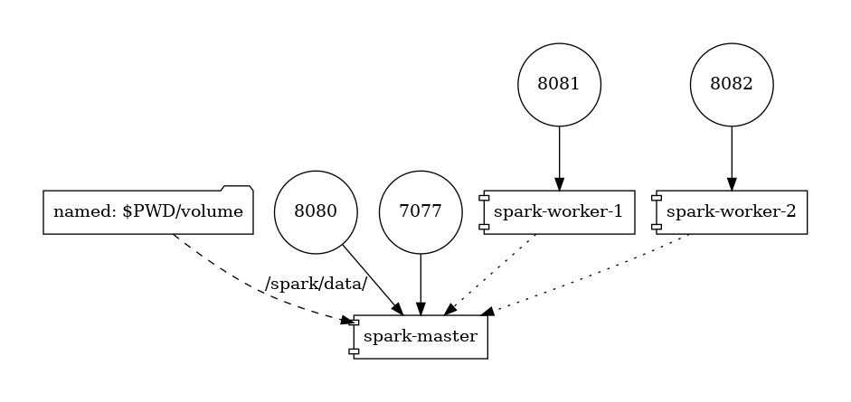

## Docker Spark Cluster

Running the cluster

```docker-compose up -d```

- ```-d``` is for background

The docker compose consists of 3 services

- spark master node 
	- open at port 8080 (webUI) and 7077 (internal communication)
	- it has a local volum for fast file transfer
- two workers open at ports 8081 and 8082

Note: the master node name changes every run!




[checking out if the cluster is up](http://localhost:8080)

connect to the master note


```docker exec -it spark-master /bin/bash```

run spark job from spark folder

```/bin/spark-submit --master  spark://<master-node-name>:7077 --class org.apache.spark.examples.JavaSparkPi  original-spark-examples_2.12-3.0.1.jar```